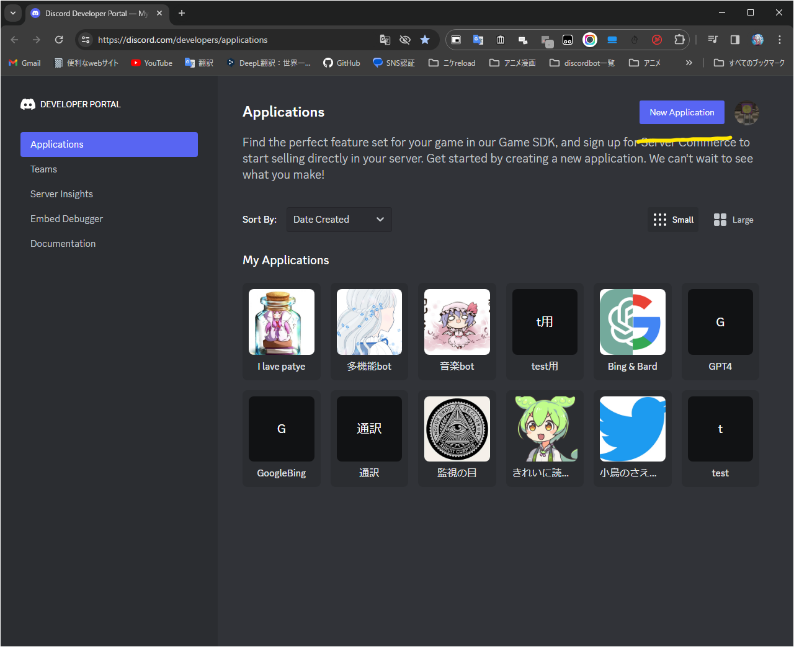
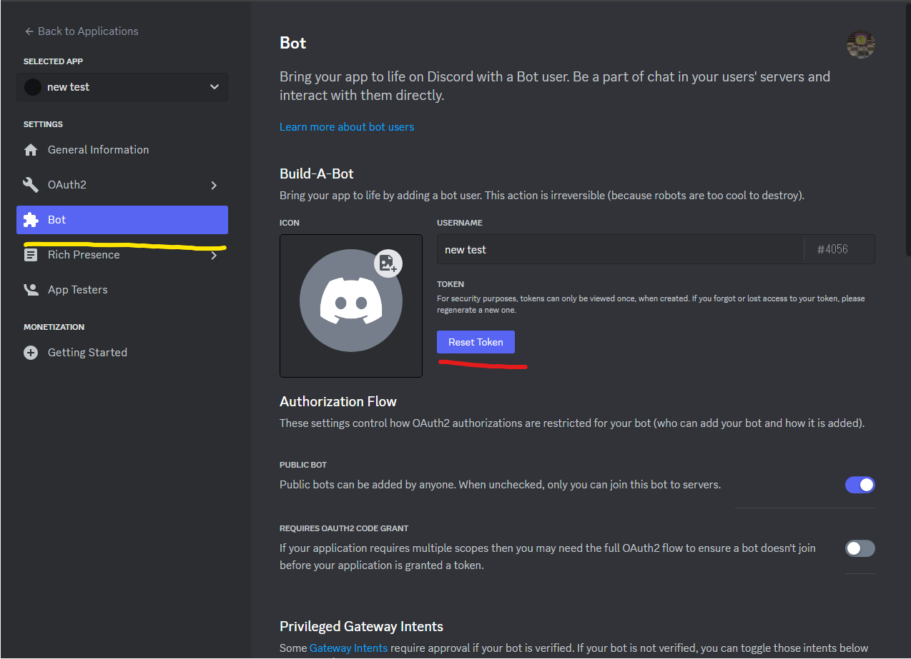
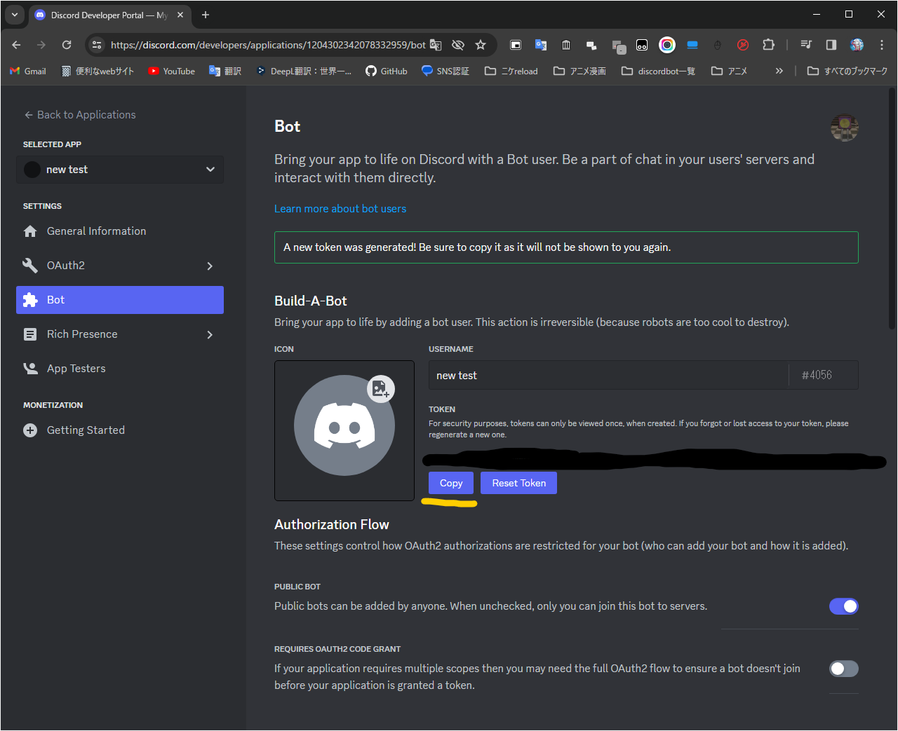
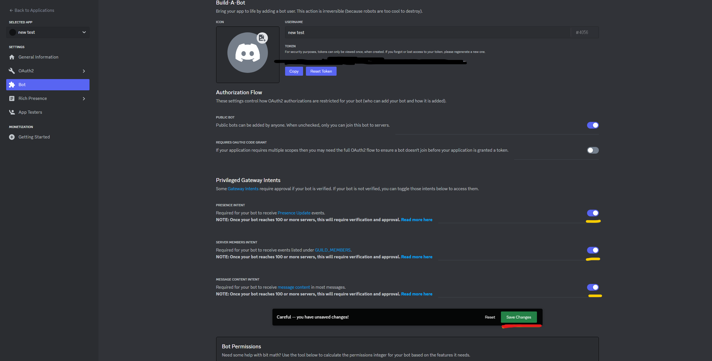
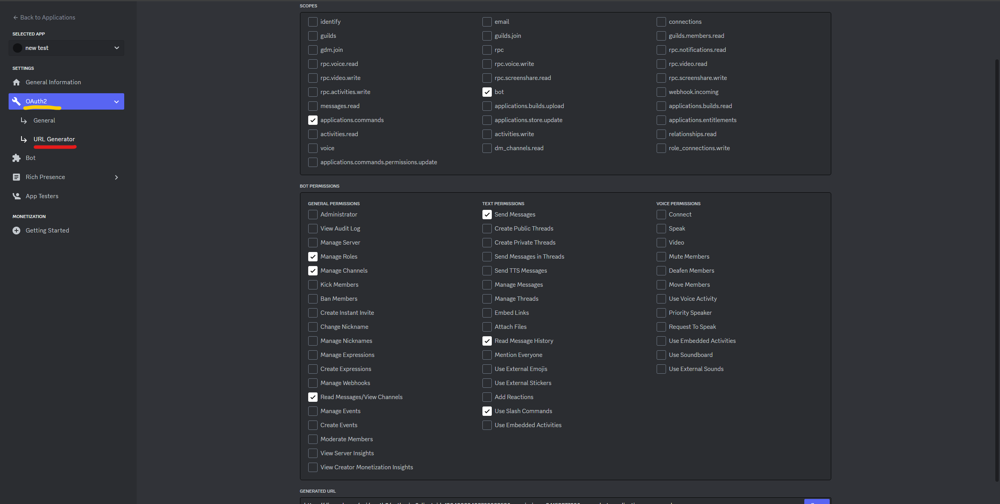
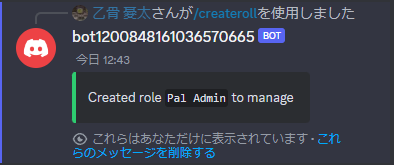
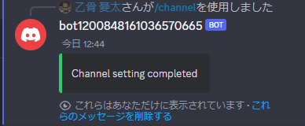
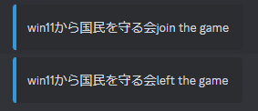
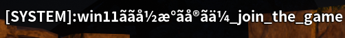
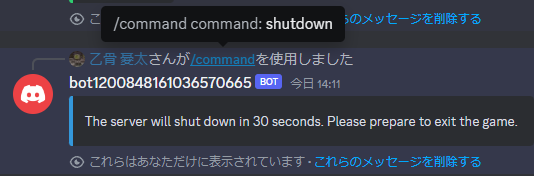

# bot to manage palworld on discord
 ## English [日本語](./ja-README.md) ##


 ### This program is currently in beta, so there may be some features that do not work. Also, since I do not speak English, I am using machine translation, so there will be a lot of strange English.
 ### Debugging was done on Ubuntu


 ### ToDolist (Hopefully one day it will end)

- [x] In-game display of join and leave
- [x] Game join and leave display on discord
- [ ] automatic restart
- [x] Only the bot administrator, server administrator, or role holder can execute commands.
- [x] Server startup and shutdown indication
- [x] Implementation with slash command
- [ ] Implement the help command
- [ ] Fixed garbled characters in non-English (waiting for official fix)
- [ ] Show steam name when logging in (waiting for official fix)
- [ ] update using steamcmd
- [ ] Support for Windows version  
- [ ] Edit INI
- [ ] web page   
### update
------------------------
#### 2024 2/6 v0.1　Only the base is implemented.
#### 2024 2/7 v0.1.1 Support for Windows
------------------------
## How to Install
```
pip install -r ./code/requirements.txt
```
<details>
<summary> <big> How to create a discord bot </big></summary>

### 1. First, please open [discord developer portal](https://discord.com/developers/applications)
### 2. Click "New Application" in the yellow line.

### 3. Click "Bot" in the yellow line.
### Click Reset Token on the red line.

### 5. Click "copy" on the yellow line to copy the discord Token.
### Stick it to the "token=" field in the settings section below.

### Scroll down to the bottom and click on the three yellow lines to turn it on, then press "save".

### 7. Click the following checkboxes and press "copy" below to create the invitation URL.

</details>

### Setup items
#### English
```en_example.env```
#### 日本語
```ja_example.env```
#### Please edit the following
```
#Server Address
server_address=
#Server's MCrcon port
server_pass = 
#server port
port =
#Administrator's discord id
discord_id =
#Discord bot token
token=
#Location of the folder with palworld
#Example: folder_pach="~/Steam/steamapps/common/PalServer"
folder_pach=
```
#### When you are done editing, edit the name to the following
```.env```
### Activation Method
#### Linux
```
./start.sh
```
#### Windows
```
./start.bat
```
## discord setup items
### Creating Administrative Roles


### Active Channel Settings



## discord command
#### under construction
```
/help
```
### Send command and bot chat to
```
/channel
```
#### Create an administrative role If not created, only the server administrator or bot owner can execute commands.
```
/createroll
```
#### Start server
```
/start
```
#### Stop server
```
/stop
```
#### Restart server
```
/restart
```
#### Sends a command to the server
```
/command command:
```
#### game update
```
/update
```
## Main Features
### Entering and exiting servers


### Secure command submission

### Start server !

