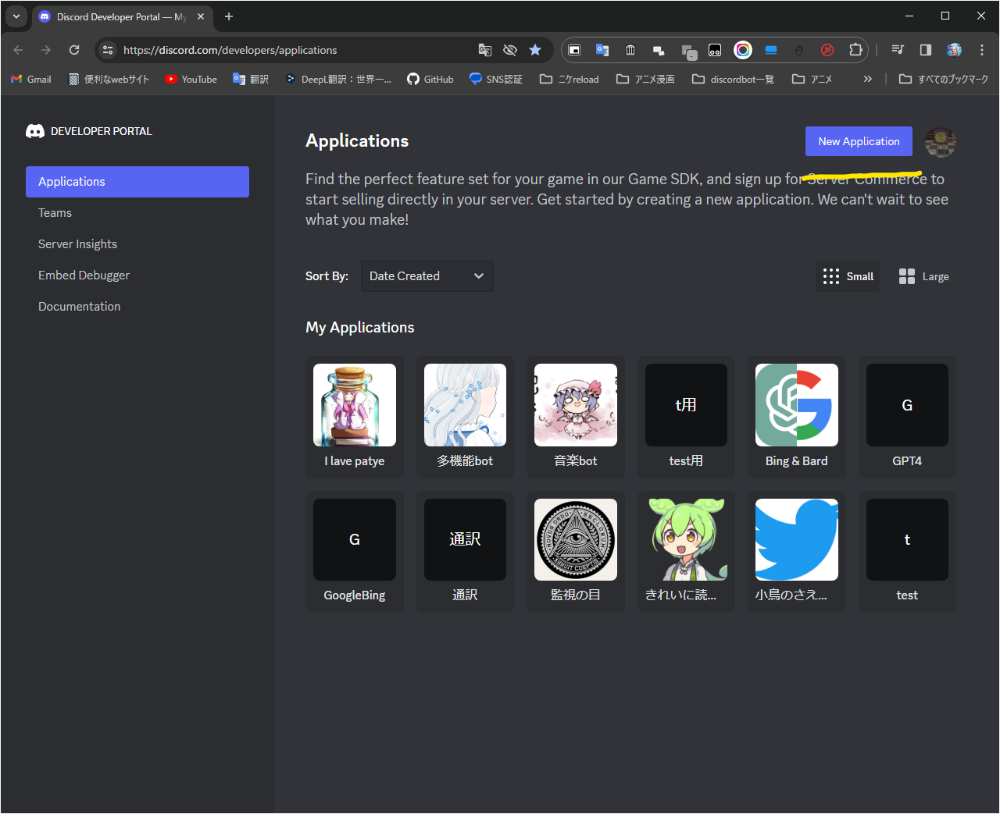
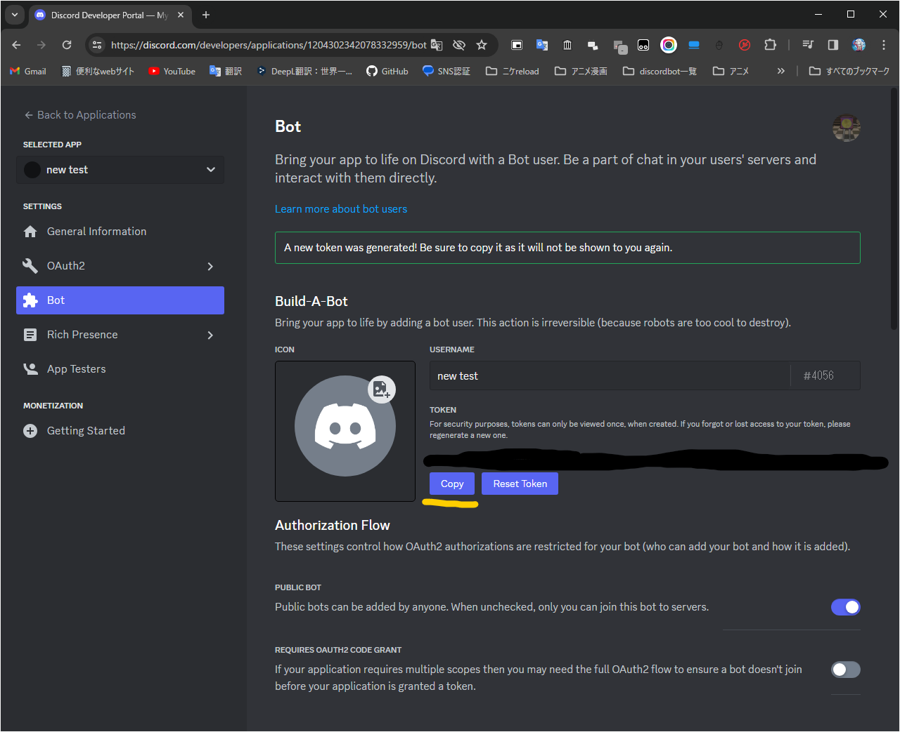
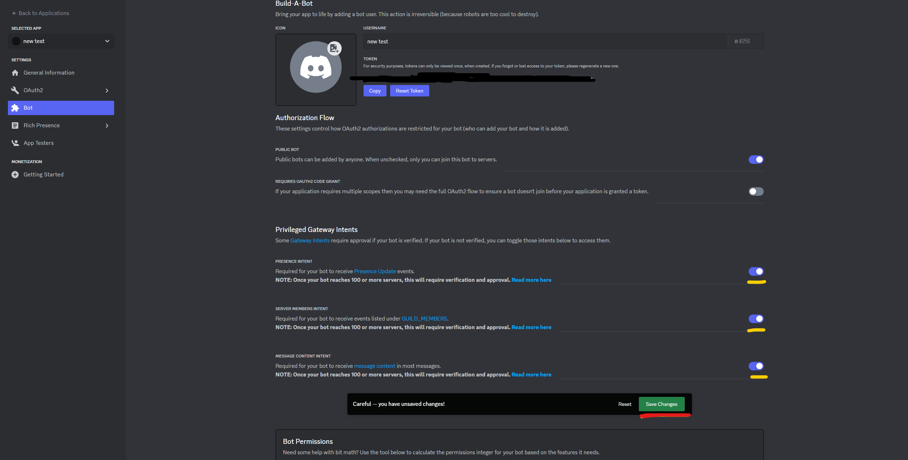
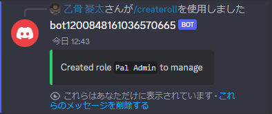

# palworldをdiscordで管理するbot
 ## [English](./README.md) 日本語 ##


 ### 現在このプログラムはβ版のため動作しない機能がある可能性があります また、英語ができないので機械翻訳を使用しているため変な英語が多いと思います 
 ### デバックはUbuntuで行いました


 ### ToDolist (いつか終わるといいな)

- [x] ゲーム内に参加、退出を表示
- [x] discordにゲームの参加、退出表示
- [ ] 自動リスタート
- [x] botの管理者もしくはサーバー管理者、ロールの所持者のみコマンド実行
- [x] サーバーの起動、停止の表示 
- [x] スラッシュコマンドでの実装
- [ ] helpコマンドを実装
- [ ] 英語以外での文字化けの修正(公式修正待ち)
- [ ] steamの名前をログイン時表示(公式修正待ち)
- [ ] steamcmdを用いたupdate
- [ ] Windows版の対応  
- [ ] iniの編集
- [ ] web実装   
### update
------------------------
2024 2/6 v0.1　ベースのみ実装
### ⚠️現在このdiscordbotはWindowsでは動作しません⚠️
## インストール方法
```
pip install -r ./code/requirements.txt
```
<details>
<summary> <big> dscord botの作成方法 </big></summary>

### 1.まずは、[discord開発者ポータル](https://discord.com/developers/applications)を開いてください
### 2.黄色い線の部分のNew Applicationをクリック

### 3.黄色い線の部分のBotをクリック
### 4.赤い線の部分のReset Tokenをクリック

### 5.黄色い線の部分のcopyををクリックしてdiscord Tokenをコピー
### 下の設定項目のtoken=に張り付けます

### 6.下にスクロールして3つの黄色い線の部分のをクリックしONにし、saveを押します

### 7.以下のチェック項目を押して下のcopyを押すと招待URLが作成さてます


</details>

### 設定項目
#### English
```en_example.env```
#### 日本語
```ja_example.env```
#### 以下を編集してください
```
#サーバーのアドレス
server_address=
#サーバーのCRconのport
server_pass = 
#サーバーport
port =
#管理者のdiscord id
discord_id =
#Discord botのtoken
token=
#palworldのあるフォルダーの場所
#例: folder_pach="~/Steam/steamapps/common/PalServer"
folder_pach=
```
#### 編集し終わったら名前を以下に編集
```.env```
### 起動方法
#### Linux
```
./start.sh
```
#### Windows
```
./start.bat
```
## discord設定項目
### 管理ロールの作成


### アクティブチャンネルの設定


## discordコマンド
#### 製作途中
```
/help
```
### コマンドとbotのチャットを送信先
```
/channel
```
#### 管理ロールを作成　作成しない場合サーバー管理者かBotの所持者のみコマンドが実行可能になっています
```
/createroll
```
#### サーバーをstart
```
/start
```
#### サーバーを停止
```
/stop
```
#### サーバーを再起動
```
/restart
```
#### サーバーにコマンドを送ります
```
/command command:
```
#### まだ動きません
```
/update
```
## 主な機能
### サーバーの入退出


### 安全なcommandの送信

### サーバーの開始

